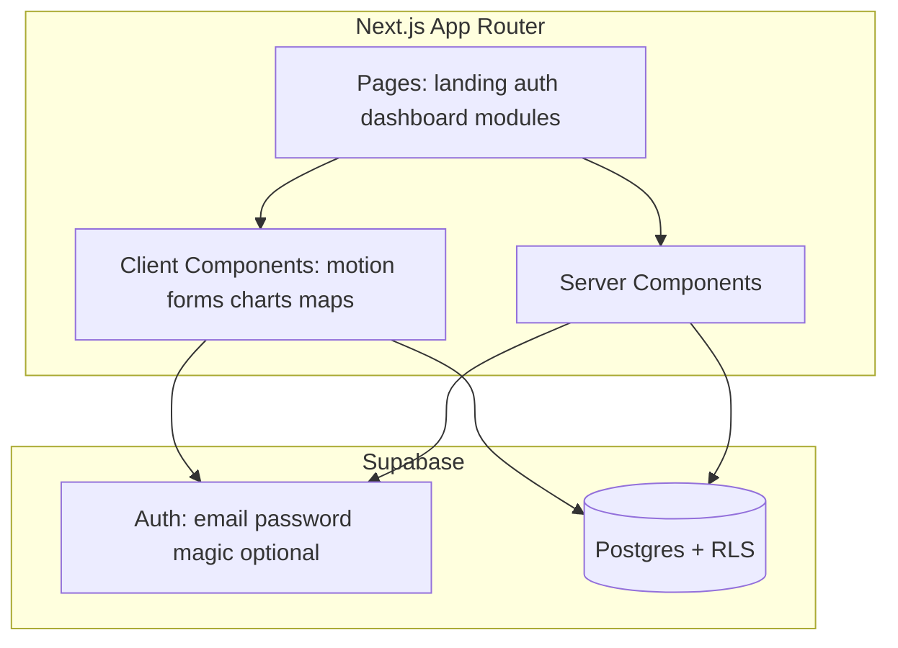

# PortGo MVP — architecture and build plan

## Current state

The [PortGO](c:\Users\CCOSTA-330\Documents\SAMUEL M\PortGO) workspace is effectively **empty**, so this is a **from-scratch** setup: `create-next-app`, Tailwind, shadcn/ui, Supabase client wiring, then features in layers.

## High-level architecture

- **Routing**: App Router under [`src/app`](src/app) with route groups for marketing vs app shell (optional `(marketing)` / `(app)` groups to separate layouts cleanly).
- **Auth**: [`@supabase/ssr`](https://supabase.com/docs/guides/auth/server-side/nextjs) with a **middleware** session refresh pattern and a small **server client** helper in [`src/lib/supabase/server.ts`](src/lib/supabase/server.ts) plus browser client in [`src/lib/supabase/client.ts`](src/lib/supabase/client.ts).
- **Protection**: Middleware matcher for `/dashboard`, `/courses`, `/tracking`, `/quote`, `/simulator`, `/profile` (and nested routes). Public: `/`, `/login`, `/register` if split.
- **Data**: Real persistence where it adds demo value (profiles, course progress, quiz results, optional saved shipments); **simulated** logic for quotes, tracking timelines, and simulator outcomes (deterministic from inputs or random seed for repeatability).

## Folder structure (aligned to your spec)

Next.js will still emit config files at the repo root (`package.json`, `next.config.mjs`, `tailwind.config.ts`, `components.json` for shadcn). Application code lives under **`src/`**:

- [`src/app`](src/app) — `layout.tsx`, `globals.css`, routes: `(marketing)/page.tsx`, `login/page.tsx`, `dashboard/...`, etc.
- [`src/components`](src/components) — shadcn primitives (`ui/`) + shared composites (`layout/`, `marketing/`, `dashboard/`)
- [`src/features`](src/features) — domain slices: `auth`, `courses`, `tracking`, `quote`, `simulator`, `profile` (each with colocated components, hooks, and small server actions where useful)
- [`src/lib`](src/lib) — `supabase/*`, `utils.ts` (cn), design tokens if needed
- [`src/services`](src/services) — thin wrappers: `courses.service.ts`, `progress.service.ts` (Supabase queries)
- [`src/hooks`](src/hooks) — `use-media-query`, `use-toast`, feature hooks
- [`src/types`](src/types) — shared TS types (Course, ShipmentSimulation, QuizQuestion, etc.)
- [`src/data`](src/data) — **mock** ports, routes, news snippets, landing stats, testimonial copy (Spanish)
- [`src/utils`](src/utils) — quote formula helpers, tracking stage resolver, id generators for demo tracking codes

**Convention**: filenames and identifiers in **English**; all **user-visible strings in Spanish** (prefer small per-feature `copy.ts` or colocated string constants to keep tone consistent and avoid scattered literals).

## Database (Supabase Postgres) — practical MVP schema

Avoid a custom `users` table that duplicates Supabase Auth. Use:

| Table | Purpose |
|--------|---------|
| `profiles` | `id` UUID **PK/FK → `auth.users.id`**, `full_name`, `avatar_url`, timestamps |
| `courses` | `id`, `title`, `description`, `category`, `slug`, optional `order_index` |
| `lessons` | `id`, `course_id`, `title`, `content_md` or JSON, `order_index` (optional if you want lesson pages without hardcoding) |
| `progress` | `user_id`, `course_id`, `progress_percentage`, `updated_at` (unique `(user_id, course_id)`) |
| `quiz_results` | `user_id`, `quiz_id`, `score`, `max_score`, `completed_at` |
| `shipments` | optional persistence: `user_id`, `tracking_code`, `origin`, `destination`, `status`, `metadata` JSONB for demo timeline snapshot |

**RLS**: enable on all public tables; policies like “users can read/write own rows” for `profiles`, `progress`, `quiz_results`, `shipments`. `courses`/`lessons` can be **world-readable** for MVP, writes admin-only (seed via SQL).

**Seeding**: SQL migration or a one-time seed script with Spanish course titles/descriptions and a minimal lesson set.

## Design system and UI stack

- **Tailwind**: CSS variables for colors (navy / ocean / cyan / neutrals) in [`src/app/globals.css`](src/app/globals.css); map to shadcn semantic tokens (`background`, `primary`, `accent`, `muted`).
- **shadcn/ui**: Button, Card, Input, Label, Form, Dialog, Dropdown, Sheet (mobile nav), Tabs, Progress, Badge, Avatar, Separator, Toast.
- **Framer Motion**: `motion` wrappers for hero, feature grids, scroll reveals (`whileInView`), subtle floating cards; respect `prefers-reduced-motion` where trivial.
- **Charts**: Recharts on dashboard (sparkline-style or small bar chart) with Spanish axis labels/tooltips.
- **Maps (optional, Phase 4)**: **Leaflet** + static tile provider for zero API keys; show origin/destination markers only (no real vessel AIS).

## Page map (routes)

| Route | Role |
|--------|------|
| `/` | Landing (all sections you listed; Spanish copy) |
| `/login` | Auth (tabs or links for register) |
| `/dashboard` | App home with stats, shipments overview, learning progress, activity, news cards |
| `/courses` | Course catalog |
| `/courses/[slug]` | Course detail + lessons list |
| `/courses/[slug]/[lessonId]` | Lesson + embedded quiz |
| `/tracking` | Tracking code input + simulated timeline (+ optional map) |
| `/quote` | Quote form + simulated breakdown |
| `/simulator` | Interactive flow (e.g. customs decision / ordered steps) |
| `/profile` | Profile, badges, activity, saved demo shipments |

## Core feature behaviors (simulated)

1. **Quote simulator**: deterministic function `estimatedPrice = f(weight, distanceKm, containerFactor, cargoTypeFactor)` with ports chosen from [`src/data/ports.ts`](src/data/ports.ts) (lat/lon for distance). Show **resumen del envío**, **ruta sugerida**, **tiempo estimado** bands (e.g. ranges, not fake precision).
2. **Tracking**: normalize code → hash to pick a **consistent** stage sequence and dates (so the same code always yields the same story). Stages: Registrado → Procesamiento portuario → En tránsito → Aduanas → Puerto de destino → Entregado.
3. **Simulator**: one strong MVP mini-experience (e.g. “ordenar pasos de exportación” or “decisiones en aduana”) implemented as a small state machine + celebratory feedback; store best completion in local state or optional `quiz_results`-like table.

## Quiz system (reusable)

- Types in [`src/types/quiz.ts`](src/types/quiz.ts): `Quiz`, `Question`, `Option`.
- Components in [`src/components/quiz`](src/components/quiz) or [`src/features/courses/components`](src/features/courses/components): `QuizRunner`, `QuestionCard`, `AnswerFeedback`, `QuizProgress`.
- State: client-side for lesson quizzes; on submit, insert/update `quiz_results` (and bump `progress` on course).

## Dependencies (npm)

**Core**: `next@14`, `react`, `react-dom`, `typescript`, `tailwindcss`, `postcss`, `autoprefixer`, `eslint` + `eslint-config-next`.

**UI / DX**: `class-variance-authority`, `clsx`, `tailwind-merge`, `tailwindcss-animate`, `@radix-ui/*` (pulled by shadcn), `lucide-react`, `framer-motion`.

**Forms / validation**: `react-hook-form`, `zod`, `@hookform/resolvers`.

**Supabase**: `@supabase/supabase-js`, `@supabase/ssr`.

**Charts**: `recharts`.

**Optional maps**: `leaflet`, `react-leaflet`, `@types/leaflet`.

**State (only if needed)**: `zustand` for cross-widget UI (e.g. sidebar collapsed); otherwise React context for theme/session UI is enough.

## Vercel readiness

- Environment variables: `NEXT_PUBLIC_SUPABASE_URL`, `NEXT_PUBLIC_SUPABASE_ANON_KEY` (document in `.env.example` only; no secrets in repo).
- `next.config` images domain allowlist if remote assets used.
- No Edge-only APIs required; middleware uses Supabase cookie pattern from official docs.

## Development phases (execution order after plan approval)

1. **Foundation**: `create-next-app` (TS, Tailwind, App Router, `src/`), ESLint, path alias `@/*`, shadcn init, base `layout`, fonts, color tokens, shared `SiteHeader`/`SiteFooter` primitives.
2. **Priority 1 — Landing + shell**: Full Spanish landing with Framer Motion sections; empty authenticated layout shell (sidebar + top bar) styled but minimal.
3. **Priority 1 — Auth + protection**: Supabase email/password (register/login/logout), middleware, `/login`, post-login redirect to `/dashboard`.
4. **Priority 1 — Dashboard**: Mock + small real slices (profile name from `profiles`); cards, charts, widgets, Spanish labels.
5. **Priority 2 — Courses + quizzes**: Seed `courses`/`lessons`, catalog pages, lesson pages, reusable quiz, write `progress` and `quiz_results`.
6. **Priority 3 — Quote**: Form + results panel + animations.
7. **Priority 4 — Tracking**: Timeline UI + optional Leaflet.
8. **Priority 5 — Simulator**: Single polished interactive module.
9. **Profile**: Aggregate progress, badges derived from thresholds, recent activity list (from DB + mock filler).

## Quality bar (lightweight, not enterprise)

- **Accessibility**: semantic headings on landing, focus states from Radix/shadcn, form labels in Spanish.
- **Performance**: prefer RSC for static sections; mark interactive islands `"use client"`.
- **Type safety**: strict TS for public API of services and quiz types.

## Risk note (Supabase + user table)

Your brief listed a `users` table; with Supabase Auth the maintainable pattern is **`profiles` + `auth.users`**. Course progress and quiz results reference `auth.users.id`.

## What you will get first after “go”

Scaffold + design tokens + landing + auth gate, then dashboard, then courses—each step leaving the app **runnable and demo-ready**, not a big-bang PR.
